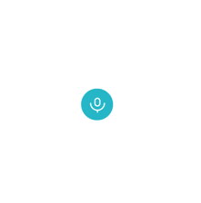

# swifty-playgrounds

Collection of xcode playgrounds I've created.

## [SimonSays](https://github.com/dmamills/swifty-playgrounds/blob/master/SimonSays.playground/Contents.swift)

That classic memory game!

## [SpeechAnimation](https://github.com/dmamills/swifty-playgrounds/blob/master/SpeechAnimation.playground/Contents.swift)

An example for a tap to speak button.

